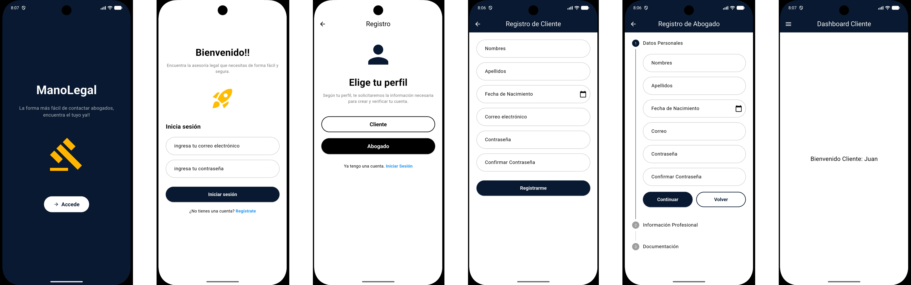
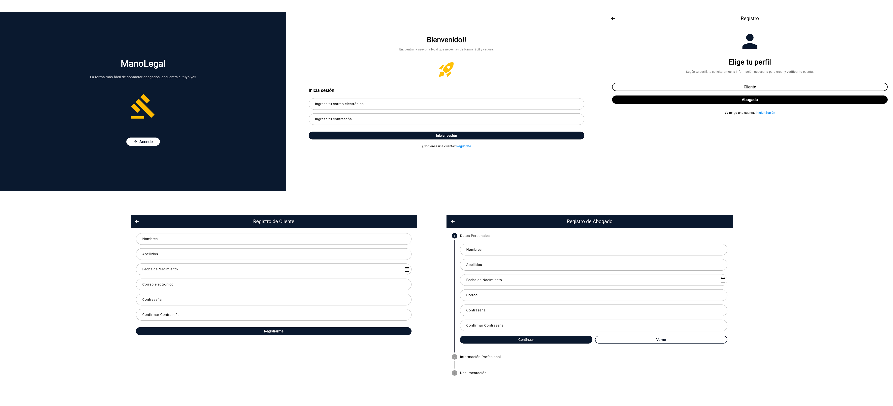

# Mano Legal App


Una plataforma móvil para conectar abogados y clientes en un entorno legal seguro y eficiente.

## 📌 Descripción del Proyecto

Mano Legal App es una aplicación móvil desarrollada como proyecto académico que facilita la conexión entre abogados especializados y clientes que requieren servicios legales. El sistema permite gestionar perfiles de usuarios, casos legales, documentos y comunicaciones, proporcionando una solución integral para la gestión de asuntos jurídicos.

Esta aplicación está diseñada para estudiantes y profesionales del derecho, ofreciendo una interfaz intuitiva y funcionalidades clave para la administración de consultas legales, seguimiento de casos y gestión documental.

## 🚀 Características Principales

- **Autenticación y Roles**: Sistema de login con tres tipos de usuarios (Admin, Abogado, Cliente)
- **Gestión de Perfiles**: Creación y administración de perfiles para abogados y clientes
- **Dashboard Personalizado**: Interfaces específicas según el rol del usuario
- **Gestión Documental**: Subida y manejo de archivos e imágenes relacionadas con casos
- **Base de Datos Local**: Almacenamiento seguro de datos usando SQLite
- **Interfaz Moderna**: Diseño Material Design con tema personalizado

## 🛠️ Tecnologías Utilizadas

| Área          | Tecnología              |
| ------------- | ----------------------- |
| Frontend      | Flutter (Dart SDK ^3.11.4) |
| Base de Datos | SQLite (sqflite ^2.4.2) |
| Gestión de Archivos | file_picker ^11.0.2, image_picker ^1.2.1 |
| Utilidades    | path_provider ^2.1.5, intl ^0.20.2, path ^1.9.1 |
| Plataformas   | Android, iOS, Web, Windows, Linux, macOS |

## 🏗️ Arquitectura del Sistema

La aplicación sigue el patrón de arquitectura **MVC (Modelo - Vista - Controlador)**:

- **Modelo (Models)**: Representan las entidades del dominio (Abogado, Cliente, etc.) y la lógica de negocio
- **Vista (Views)**: Contienen la interfaz de usuario organizada en pantallas (auth, dashboards, widgets)
- **Controlador (Controllers)**: Gestionan la lógica de aplicación y la comunicación entre modelos y vistas

Esta estructura permite una separación clara de responsabilidades, facilitando el mantenimiento y escalabilidad del código.

## 📂 Estructura del Proyecto

```
GestionProyecto/
├── Desarrollo/
│   └── mano_legal_app/          # Código fuente de la aplicación Flutter
│       ├── lib/
│       │   ├── controllers/     # Lógica de controladores
│       │   ├── models/          # Modelos de datos
│       │   ├── views/           # Interfaces de usuario
│       │   │   ├── auth/        # Pantallas de autenticación
│       │   │   ├── dashboards/  # Dashboards por rol
│       │   │   ├── theme/       # Configuración de temas
│       │   │   └── widgets/     # Componentes reutilizables
│       │   └── main.dart        # Punto de entrada
│       ├── android/             # Configuración Android
│       ├── ios/                 # Configuración iOS
│       ├── web/                 # Configuración Web
│       └── pubspec.yaml         # Dependencias y configuración
└── Documentacion/               # Documentación del proyecto
```

## 📱 Mockups




## ⚙️ Instalación y Ejecución

### Prerrequisitos

- Flutter SDK instalado ([Instalación](https://flutter.dev/docs/get-started/install))
- Dart SDK ^3.11.4
- Un editor como Visual Studio Code con extensiones de Flutter

### Pasos de Instalación

1. **Clonar el repositorio** (si aplica) o navegar a la carpeta del proyecto
2. **Instalar dependencias**:
   ```bash
   cd Desarrollo/mano_legal_app
   flutter pub get
   ```
3. **Verificar instalación**:
   ```bash
   flutter doctor
   ```
4. **Ejecutar la aplicación**:
   ```bash
   flutter run
   ```

### Ejecutar en Dispositivos Específicos

- **Android**: `flutter run -d android`
- **iOS**: `flutter run -d ios` (requiere macOS)
- **Web**: `flutter run -d chrome`
- **Emulador**: `flutter emulators --launch <emulator_id>`

## 📊 Diagramas

### Diagrama de Componentes


*Descripción: Muestra la interacción entre los componentes principales del sistema MVC.*

### Diagrama de Despliegue


*Descripción: Arquitectura de despliegue en diferentes plataformas soportadas.*

## 👥 Equipo de Desarrollo

- **Desarrollador Principal**: [Nombre del Estudiante]
- **Supervisor Académico**: [Nombre del Profesor]
- **Colaboradores**: [Nombres adicionales si aplica]

## 📌 Estado del Proyecto

🔄 **En Desarrollo / En Revisión Académica**

El proyecto se encuentra en fase de desarrollo activo como parte de un trabajo académico universitario. Las funcionalidades principales están implementadas y probadas.

## 🧠 Notas Adicionales

- La aplicación utiliza almacenamiento local (SQLite) para persistencia de datos
- Soporte multi-plataforma gracias a Flutter
- Diseño responsive adaptado para móviles y tablets
- Implementación de buenas prácticas de desarrollo Flutter

---

*Proyecto desarrollado para la obtención de titulo profesional*